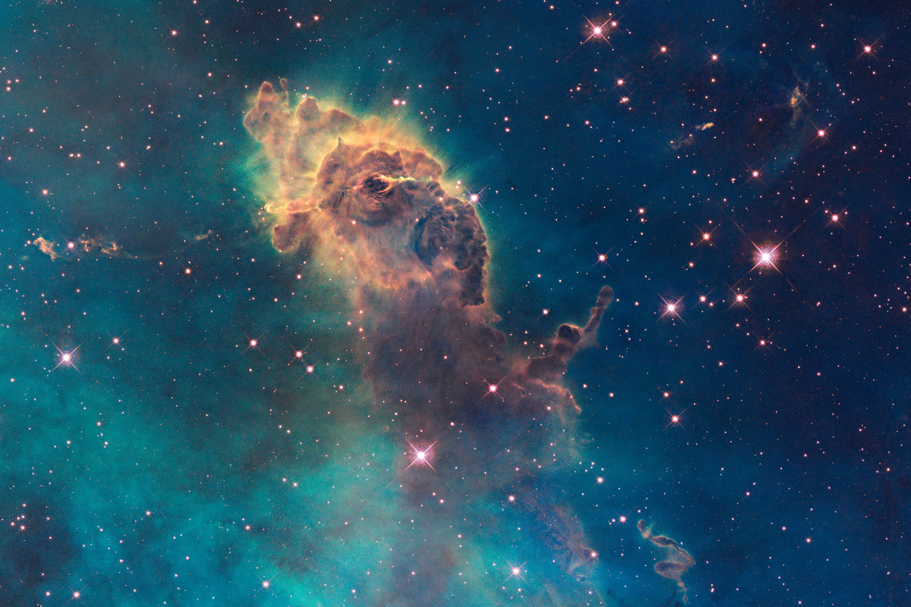

# David Rubello Matrix Compiler

## Syntax for Compiler

Put all content into the file contents.txt, place contents for each page in the order that they will be situated on the index page.

### The following text:

    %slug a_new_page 
    %title Title For the Page 

    A paragraph...no synatax indicator needed... will go on until the next carriage return

    %img example_1.jpg
    %img-caption A caption for the image 

    A paragraph...with a link %link [ slug_to_link_to, Title or other Linking Text ] in the middle of it.

### Will Compile to:

    <!DOCTYPE html>
    <html lang="en">
    <head>
    <meta name="description" content="David Rubello" />
    <meta http-equiv="Content-Type" content="text/html; charset=utf-8" />
    <meta name="viewport" content="width=device-width, initial-scale=1 user-scalable=0" />
    <title>Title For the Page</title>
    <link rel="stylesheet" href="css/main.css" />
    </head>
    <body class="dk-green">
    

    <h1>Title For the Page</h1>
    
A paragraph...no synatax indicator needed... will go on until the next carriage return

    
A caption for the image

    
A paragraph...with a link %link [ slug_to_link_to, Title or other Linking Text ] in the middle of it.

    

    </body>
    </html>

## To run compiler:

    cd rubellow piper
    chmod 777 compiler.rb
    ./compiler.rb
